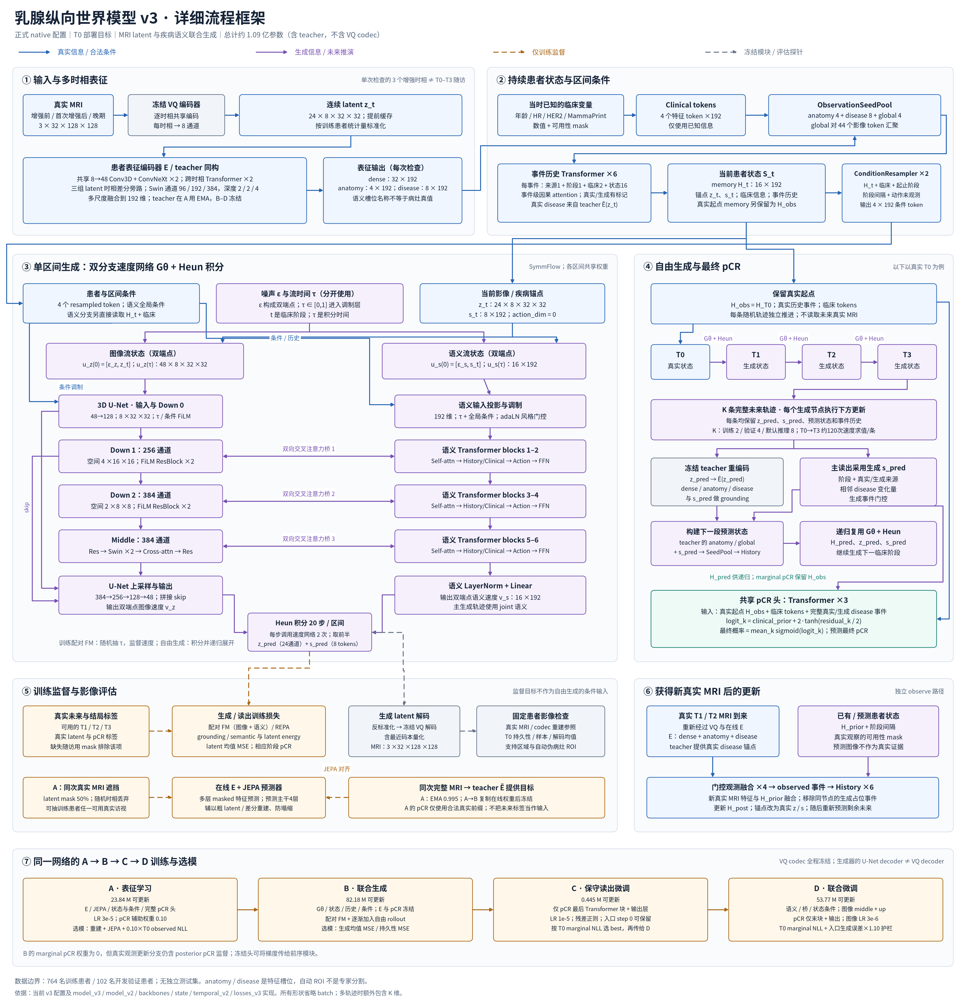

# Breast Response World Model V3

**Version 3.0.0** models longitudinal breast MRI and predicts final pathological complete response (pCR). The primary deployment task uses **real T0 MRI and baseline clinical information**, generates possible T1–T3 trajectories, and averages their pCR probabilities.

[中文首页](README_ZH.md) · [Chinese run guide](docs/V3_RUN_ZH.md) · [V3 protocol](docs/MULTISTAGE_V3_PROTOCOL_ZH.md) · [Release notes](docs/RELEASE_V3_20261002.md)



[Vector PDF](docs/figures/breast-v3-detailed-framework.pdf) · [Editable SVG](docs/figures/breast-v3-detailed-framework.svg)

## Architecture and training

Each visit contains three MRI enhancement phases. A frozen VQ codec produces continuous latents of shape `[24,8,32,32]`. A shared ConvNeXt/Swin encoder, clinical tokens and an event-causal history Transformer construct the patient state. A native 3D U-Net and six-block semantic flow Transformer jointly generate the next image latent and disease tokens through **three bidirectional attention bridges**. The generator advances T0→T1→T2→T3 with 20-step Heun integration per interval.

Generated states drive subsequent intervals. The primary T0 marginal pCR readout keeps the **real T0 memory** and reads the full generated disease trajectory. Its logit is a training-only fitted clinical prior plus a bounded learned residual. New real MRI follows a separate observation-assimilation path; future ground truth is not supplied to free generation.

| Stage | Update and selection policy | Physical batch |
|---|---|---:|
| A: representation | Reconstruction/JEPA and auxiliary pCR; LR `3e-5` | 160 |
| B: generation | Coupled flow, grounding and free-generation objectives; selection against T0 persistence | 32 |
| C: readout | Last pCR Transformer block and output; LR `1e-5`; entry checkpoint may remain best | 192 |
| D: joint | Conservative generator/state/readout updates; entry may remain best; generation degradation guard | 32 |

B has zero marginal-pCR loss weight, but observed-update pCR supervision still backpropagates through the frozen readout into state/generation modules. C/D selection uses prespecified T0 full-future marginal NLL; D also requires generation error within 1.10× its entry value. The multiseed queue allows two A jobs concurrently and gives B/C/D exclusive stage access, including evaluation. Batch sizes count tasks, not distinct patients; missing visits remain missing.

## Install and run

Use Linux and Python **3.11+**. Install a PyTorch/CUDA build compatible with your GPU before installing this package. MONAI is optional; V3 production uses the native backend.

```bash
python -m pip install -e '.[test]'
python -m pytest -q
python joint.py smoke-v3 \
  --config configs/multistage_smoke_v3.yaml \
  --output runs/v3_smoke
```

Choose a new smoke output directory. Smoke data and scores are synthetic engineering checks. Actual release verification is recorded in [reports/release_validation.json](reports/release_validation.json).

After preparing private data and the imaging bundle as described in the [run guide](docs/V3_RUN_ZH.md):

```bash
python joint.py train-v3 \
  --config configs/ispy2_multistage_native_v3.yaml \
  --manifest data/trajectories/patient_trajectories_v2.json \
  --output runs/v3_primary --stage all
```

Resume with the same command plus `--resume`. V3 reuses the V2 **patient data schema** and preparation script; V3 checkpoints must be loaded by V3 code. Historical `train-v2`, `evaluate-v2`, `forecast-v2` and related checkpoint commands are not V3 interfaces.

## Release scope

This release includes source, configurations, tests, documentation and diagrams. **Patient data, patient-level results and trained weights are not included.** It does not assert that ongoing training has finished or that V3 outperforms a baseline. The development protocol uses 764 training and 102 validation patients without an independent test cohort; its imaging diagnostic subset contains eight prespecified validation patients.

Before release adjustments, 83 local Python files matched the deployed source archive. Packaging changes do not alter model or training logic; source identity and verification limits are documented in the [release notes](docs/RELEASE_V3_20261002.md). Historical documents and reports are not evidence of current V3 performance.

Licensing is mixed: new original additions are MIT; adapted codec/DiT components retain CC BY-NC 4.0; other components retain their original notices. See [LICENSE](LICENSE), [licenses/](licenses), [source provenance](docs/SOURCES.md) and [multistage provenance](docs/MULTISTAGE_NETWORK_SOURCES.md).
